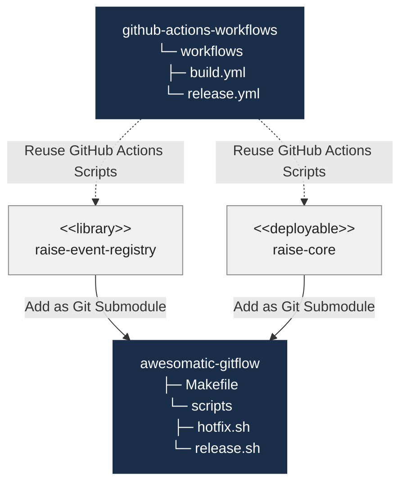
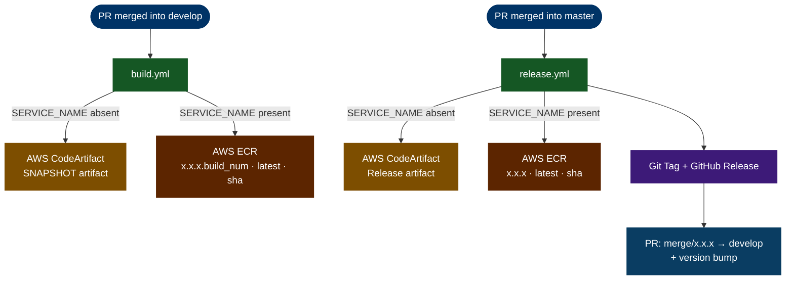

# GitHub Actions Workflows

[](https://opensource.org/licenses/MIT)
[](https://awesomaticza.github.io/github-workflows/)
[](https://github.com/awesomaticza/github-workflows/actions/workflows/deploy-docs.yml)
[](https://openjdk.org/projects/jdk/21/)
[](https://spring.io/projects/spring-boot)
[](https://maven.apache.org/)
[](https://aws.amazon.com/ecr/)
[](https://aws.amazon.com/codeartifact/)

A library of reusable GitHub Actions workflows for the Awesomatic platform. Rather than duplicating CI/CD logic across every project, consuming projects reference these workflows via `workflow_call`, keeping pipelines consistent and changes centralised.

## Architecture



Two types of projects consume these workflows:

| Project type | Example | Build workflow | Release workflow |
|---|---|---|---|
| **Library** — Maven JAR published to AWS CodeArtifact | `raise-event-registry` | `build.yml` | `release.yml` |
| **Deployable** — Spring Boot app published as Docker image to AWS ECR | `raise-core` | `build.yml` | `release.yml` |

Both project types also add `awesomatic-gitflow` as a git submodule to manage the `make release` / `make hotfix` commands that feed into these pipelines.

## Workflows



### `build.yml`
Triggered when a PR is merged into `develop`. Authenticates with AWS, configures Maven to resolve and deploy to AWS CodeArtifact, then publishes the artifact. If `SERVICE_NAME` is provided, builds a Docker image via `spring-boot:build-image` and pushes it to ECR tagged as `x.x.x.<build_number>`, `latest`, and the short commit hash. If `SERVICE_NAME` is omitted, runs `mvn deploy -Pbuild` to publish the SNAPSHOT artifact to CodeArtifact.

### `release.yml`
Triggered when a PR is merged into `master`. Publishes the release artifact, then:
1. Creates a git tag and GitHub release for the version in `pom.xml`
2. Opens a PR to merge `master` back into `develop`, bumping the minor version (e.g. `1.2.0` → `1.3.0-SNAPSHOT`). For hotfixes (patch version > 0), the version bump is skipped.

If `SERVICE_NAME` is provided, builds and pushes the Docker image to ECR tagged with the exact release version, `latest`, and the short commit hash before tagging. If `SERVICE_NAME` is omitted, runs `mvn deploy -Pbuild` to publish the release artifact to CodeArtifact.

## How to Use

### Library project (Maven JAR → AWS CodeArtifact)

`.github/workflows/build.yml` — triggered on PR merged into `develop`:

```yaml
name: "Build My Library"

on:
  pull_request:
    types: [ closed ]
    branches: [ develop ]

jobs:
  build-workflow:
    uses: awesomaticza/github-workflows/.github/workflows/build.yml@master
    with:
      AWS_REGION: ${{ vars.AWS_REGION }}
    secrets:
      AWS_ACCESS_KEY_ID: ${{ secrets.AWS_ACCESS_KEY_ID }}
      AWS_ACCOUNT_ID: ${{ secrets.AWS_ACCOUNT_ID }}
      AWS_SECRET_ACCESS_KEY: ${{ secrets.AWS_SECRET_ACCESS_KEY }}
      CODEARTIFACT_DOMAIN: ${{ secrets.CODEARTIFACT_DOMAIN }}
      CODEARTIFACT_RELEASES_REPO: ${{ secrets.CODEARTIFACT_RELEASES_REPO }}
      CODEARTIFACT_SNAPSHOTS_REPO: ${{ secrets.CODEARTIFACT_SNAPSHOTS_REPO }}
```

`.github/workflows/release.yml` — triggered on PR merged into `master`:

```yaml
name: "Release My Library"

on:
  pull_request:
    types: [ closed ]
    branches: [ master ]

jobs:
  release-workflow:
    uses: awesomaticza/github-workflows/.github/workflows/release.yml@master
    with:
      AWS_REGION: ${{ vars.AWS_REGION }}
    secrets:
      AWS_ACCESS_KEY_ID: ${{ secrets.AWS_ACCESS_KEY_ID }}
      AWS_ACCOUNT_ID: ${{ secrets.AWS_ACCOUNT_ID }}
      AWS_SECRET_ACCESS_KEY: ${{ secrets.AWS_SECRET_ACCESS_KEY }}
      CI_APP_ID: ${{ secrets.CI_APP_ID }}
      CI_APP_PRIVATE_KEY: ${{ secrets.CI_APP_PRIVATE_KEY }}
      CODEARTIFACT_DOMAIN: ${{ secrets.CODEARTIFACT_DOMAIN }}
      CODEARTIFACT_RELEASES_REPO: ${{ secrets.CODEARTIFACT_RELEASES_REPO }}
      CODEARTIFACT_SNAPSHOTS_REPO: ${{ secrets.CODEARTIFACT_SNAPSHOTS_REPO }}
```

---

### Deployable project (Docker image → AWS ECR)

`.github/workflows/build.yml` — triggered on PR merged into `develop`:

```yaml
name: "Build My Service"

on:
  pull_request:
    types: [ closed ]
    branches: [ develop ]

jobs:
  build-workflow:
    uses: awesomaticza/github-workflows/.github/workflows/build.yml@master
    with:
      AWS_REGION: ${{ vars.AWS_REGION }}
      SERVICE_NAME: my-service
    secrets:
      AWS_ACCESS_KEY_ID: ${{ secrets.AWS_ACCESS_KEY_ID }}
      AWS_ACCOUNT_ID: ${{ secrets.AWS_ACCOUNT_ID }}
      AWS_SECRET_ACCESS_KEY: ${{ secrets.AWS_SECRET_ACCESS_KEY }}
      CODEARTIFACT_DOMAIN: ${{ secrets.CODEARTIFACT_DOMAIN }}
      CODEARTIFACT_RELEASES_REPO: ${{ secrets.CODEARTIFACT_RELEASES_REPO }}
      CODEARTIFACT_SNAPSHOTS_REPO: ${{ secrets.CODEARTIFACT_SNAPSHOTS_REPO }}
```

`.github/workflows/release.yml` — triggered on PR merged into `master`:

```yaml
name: "Release My Service"

on:
  pull_request:
    types: [ closed ]
    branches: [ master ]

jobs:
  release-workflow:
    uses: awesomaticza/github-workflows/.github/workflows/release.yml@master
    with:
      AWS_REGION: ${{ vars.AWS_REGION }}
      SERVICE_NAME: my-service
    secrets:
      AWS_ACCESS_KEY_ID: ${{ secrets.AWS_ACCESS_KEY_ID }}
      AWS_ACCOUNT_ID: ${{ secrets.AWS_ACCOUNT_ID }}
      AWS_SECRET_ACCESS_KEY: ${{ secrets.AWS_SECRET_ACCESS_KEY }}
      CI_APP_ID: ${{ secrets.CI_APP_ID }}
      CI_APP_PRIVATE_KEY: ${{ secrets.CI_APP_PRIVATE_KEY }}
      CODEARTIFACT_DOMAIN: ${{ secrets.CODEARTIFACT_DOMAIN }}
      CODEARTIFACT_RELEASES_REPO: ${{ secrets.CODEARTIFACT_RELEASES_REPO }}
      CODEARTIFACT_SNAPSHOTS_REPO: ${{ secrets.CODEARTIFACT_SNAPSHOTS_REPO }}
```

## Required Secrets and Variables

| Name | Type | Required by |
|---|---|---|
| `AWS_REGION` | Variable | All workflows |
| `AWS_ACCESS_KEY_ID` | Secret | All workflows |
| `AWS_SECRET_ACCESS_KEY` | Secret | All workflows |
| `AWS_ACCOUNT_ID` | Secret | All workflows |
| `CODEARTIFACT_DOMAIN` | Secret | All workflows |
| `CODEARTIFACT_RELEASES_REPO` | Secret | All workflows |
| `CODEARTIFACT_SNAPSHOTS_REPO` | Secret | All workflows |
| `CI_APP_ID` | Secret | Release workflows only |
| `CI_APP_PRIVATE_KEY` | Secret | Release workflows only |

`CI_APP_ID` and `CI_APP_PRIVATE_KEY` are credentials for a GitHub App. The release workflows use the app's token (rather than `GITHUB_TOKEN`) to push the version bump commit and create the merge-back PR — actions that the default token cannot trigger further workflow runs for.
