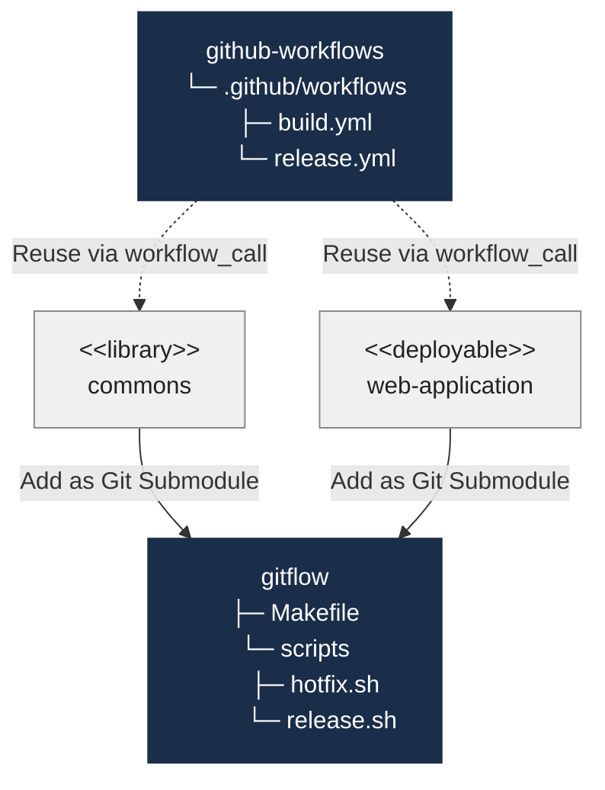
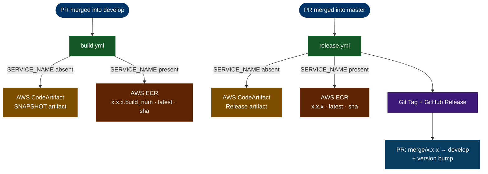

# github-workflows

`github-workflows` is a library of **reusable GitHub Actions workflows** for the GitFlow branching and release strategy. Consumer projects reference these centrally-managed workflows via `workflow_call`, keeping CI/CD logic consistent and changes centralised.

It is the server-side counterpart to [gitflow](https://awesomaticza.github.io/gitflow/) — the developer-side automation toolkit. Together the two repos cover the full GitFlow lifecycle.

:::note Tech stack
The workflows are built around **Java 21**, **Spring Boot**, **Apache Maven**, **AWS Elastic Container Registry (ECR)**, and **AWS CodeArtifact**. This reflects the platform they were designed for, but the patterns are straightforward to adapt to any tech stack, cloud provider, or artifact registry.

**Gradle support** is on the roadmap.
:::

## What Problem Does It Solve?

Without this repo, every project would need to duplicate hundreds of lines of CI/CD YAML. With `workflow_call`, a consuming project's entire build pipeline is a 15-line file that says "run that centralised workflow with these inputs and secrets."

Changes to the pipeline — upgrading a GitHub Action version, tweaking image tagging, fixing a Maven command — happen once here and propagate to every consumer automatically.

## Full Architecture

Consumer projects wire in both repos:

- **[gitflow](https://awesomaticza.github.io/gitflow/)** — add the [gitflow repository](https://github.com/awesomaticza/gitflow) as a git submodule in the root folder of the consumer project. To initiate the process, developers execute `make release` or `make hotfix` locally, which creates the corresponding branch and opens a PR all in one step.
- **`github-workflows`** - this [repository](https://github.com/awesomaticza/github-workflows) is referenced via `workflow_call` from the GitHub Actions scripts in the consumer's own `.github/workflows` folder. Once the PR lands on `master`, GitHub Actions takes over: publishing artifacts, tagging the release, and opening a back-merge PR into `develop` automatically.

## Two Project Types

| Project type | Build trigger | Release trigger |
|---|---|---|
| **Library** — Maven JAR → AWS CodeArtifact | PR merged into `develop` | PR merged into `master` |
| **Deployable** — Spring Boot app → Docker image → AWS ECR | PR merged into `develop` | PR merged into `master` |

The discriminator is `SERVICE_NAME`. When it is provided, the workflow takes the Docker/ECR path. When it is omitted, the workflow takes the Maven library/CodeArtifact path.

## Workflow Overview

