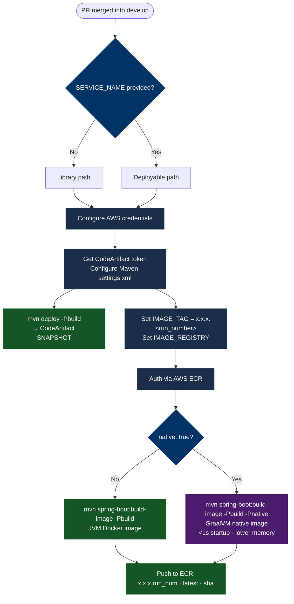

# build.yml

Triggered when a PR is merged into `develop`. Builds and publishes the artifact for the development iteration.

## What It Does



## Steps

1. **Set Variables** _(deployable only)_ — reads the project version from `pom.xml`, strips `-SNAPSHOT`, and constructs the image tag as `<version>.<github.run_number>` and the image registry URL.
2. **Configure AWS Credentials** — authenticates with AWS using `aws-actions/configure-aws-credentials@v4`.
3. **Auth via AWS ECR** _(deployable only)_ — logs Docker into the ECR registry.
4. **Configure Maven for CodeArtifact** — obtains a short-lived CodeArtifact token and writes `~/.m2/settings.xml` with the release and snapshot server credentials.
5. **Deploy Library Artifact** _(library only)_ — runs `mvn deploy -Pbuild` to publish the SNAPSHOT JAR to CodeArtifact.
6. **Build image** _(deployable only)_ — runs `mvn spring-boot:build-image` to produce a Docker image. When `native: true`, adds `-Pnative` to activate the GraalVM Buildpack — the native image is compiled inside Docker, no local GraalVM installation required.
7. **Push image to ECR** _(deployable only)_ — pushes three tags: `x.x.x.<run_number>`, `latest`, and the 8-character commit hash.

## Inputs

| Input | Required | Default | Description |
|---|---|---|---|
| `AWS_REGION` | Yes | — | AWS region for CodeArtifact and ECR |
| `SERVICE_NAME` | No | `''` | ECR repository name. Omit for library projects. |
| `java-version` | No | `'21'` | Temurin JDK version passed to `actions/setup-java`. Set to `'25'` (or any supported version) to override. |
| `working-directory` | No | `'.'` | Directory containing `pom.xml`. Set to the service subdirectory in a monorepo. All Maven commands and Docker steps run from this path. |
| `native` | No | `false` | When `true`, adds `-Pnative` to the build-image command. Requires a `native` Maven profile with `native-maven-plugin` in `pom.xml`. Produces a GraalVM native image — expect a **5–15 min** build time increase. |

## The `SERVICE_NAME` Discriminator

`SERVICE_NAME` is an optional workflow input with an empty default. Its presence or absence determines which steps execute:

| `SERVICE_NAME` | Path taken |
|---|---|
| Omitted | Maven library → `mvn deploy` → CodeArtifact SNAPSHOT |
| `my-service` | Spring Boot Docker image → ECR tagged `x.x.x.<run_num>` / `latest` / `sha` |

## Image Tag Format

For deployable builds, the image tag includes the build number to make every build uniquely addressable even before a release:

```
<version>.<github.run_number>   e.g. 1.3.0.42
latest
<8-char commit hash>            e.g. a1b2c3d4
```

This differs from the release tag format — see [release.yml](./release) for comparison.

## Monorepo Usage

In a monorepo where the service `pom.xml` lives under a subdirectory, pass `working-directory` to scope all Maven and Docker steps to that path. The default `.` keeps single-repo projects working with no changes.

```yaml
# .github/workflows/build-my-service.yml
name: "Build My Service"

on:
  pull_request:
    types: [closed]
    branches: [develop]
    paths: ['services/my-service/**']   # only trigger for this service

jobs:
  build-workflow:
    uses: awesomaticza/github-workflows/.github/workflows/build.yml@master
    with:
      AWS_REGION: ${{ vars.AWS_REGION }}
      SERVICE_NAME: my-service
      java-version: '25'
      working-directory: services/my-service   # pom.xml lives here
      native: true                             # omit or set false for JVM image
    secrets:
      AWS_ACCESS_KEY_ID: ${{ secrets.AWS_ACCESS_KEY_ID }}
      AWS_ACCOUNT_ID: ${{ secrets.AWS_ACCOUNT_ID }}
      AWS_SECRET_ACCESS_KEY: ${{ secrets.AWS_SECRET_ACCESS_KEY }}
      CODEARTIFACT_DOMAIN: ${{ secrets.CODEARTIFACT_DOMAIN }}
      CODEARTIFACT_RELEASES_REPO: ${{ secrets.CODEARTIFACT_RELEASES_REPO }}
      CODEARTIFACT_SNAPSHOTS_REPO: ${{ secrets.CODEARTIFACT_SNAPSHOTS_REPO }}
```

Each service in the monorepo gets its own workflow file with its own `paths:` filter and `working-directory`. A change to `services/payment/**` triggers only the payment service build — other services are unaffected.

```
monorepo/
├── services/
│   ├── my-service/          ← working-directory: services/my-service
│   │   └── pom.xml
│   └── payment/             ← working-directory: services/payment
│       └── pom.xml
└── .github/workflows/
    ├── build-my-service.yml
    └── build-payment.yml
```

## GraalVM Native Image

Setting `native: true` switches the build from a JVM fat-jar image to a GraalVM native executable. The native compilation happens entirely inside the Paketo buildpack container — no GraalVM JDK needs to be installed on the runner.

**Trade-offs:**

| | JVM image (default) | Native image (`native: true`) |
|---|---|---|
| CI build time | ~2–3 min | ~10–15 min |
| Container startup | 20–40 s | < 1 s |
| Memory footprint | ~400 MB RSS | ~100 MB RSS |
| ECS autoscaling speed | Slow (JVM warm-up) | Fast (instant) |

**Prerequisites in `pom.xml`:**

```xml
<profiles>
  <profile>
    <id>native</id>
    <build>
      <plugins>
        <plugin>
          <groupId>org.graalvm.buildtools</groupId>
          <artifactId>native-maven-plugin</artifactId>
        </plugin>
      </plugins>
    </build>
  </profile>
</profiles>
```

:::caution
Verify the native image boots correctly locally (`mvn spring-boot:build-image -Pnative`) before enabling this in CI. Libraries that rely on runtime reflection (Liquibase, Spring Modulith JDBC event store) require AOT reachability hints — missing hints surface as `ClassNotFoundException` at container start, not at build time.
:::

## Maven Profile

All Maven commands pass `-Pbuild`. Your project's `pom.xml` must define a `build` profile. The `exec-maven-plugin` submodule-update executions are typically bound to the default lifecycle; the `build` profile suppresses them on CI. See [Getting Started](../getting-started) for the Maven configuration.
