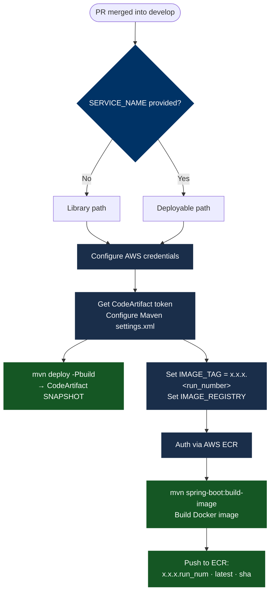

# build.yml

Triggered when a PR is merged into `develop`. Builds and publishes the artifact for the development iteration.

## What It Does



## Steps

1. **Set Variables** _(deployable only)_ — reads the project version from `pom.xml`, strips `-SNAPSHOT`, and constructs the image tag as `<version>.<github.run_number>` and the image registry URL.
2. **Configure AWS Credentials** — authenticates with AWS using `aws-actions/configure-aws-credentials@v4`.
3. **Auth via AWS ECR** _(deployable only)_ — logs Docker into the ECR registry.
4. **Configure Maven for CodeArtifact** — obtains a short-lived CodeArtifact token and writes `~/.m2/settings.xml` with the release and snapshot server credentials.
5. **Deploy Library Artifact** _(library only)_ — runs `mvn deploy -Pbuild` to publish the SNAPSHOT JAR to CodeArtifact.
6. **Build image** _(deployable only)_ — runs `mvn spring-boot:build-image` to produce a Docker image.
7. **Push image to ECR** _(deployable only)_ — pushes three tags: `x.x.x.<run_number>`, `latest`, and the 8-character commit hash.

## Inputs

| Input | Required | Default | Description |
|---|---|---|---|
| `AWS_REGION` | Yes | — | AWS region for CodeArtifact and ECR |
| `SERVICE_NAME` | No | `''` | ECR repository name. Omit for library projects. |
| `java-version` | No | `'21'` | Temurin JDK version passed to `actions/setup-java`. Set to `'25'` (or any supported version) to override. |

## The `SERVICE_NAME` Discriminator

`SERVICE_NAME` is an optional workflow input with an empty default. Its presence or absence determines which steps execute:

| `SERVICE_NAME` | Path taken |
|---|---|
| Omitted | Maven library → `mvn deploy` → CodeArtifact SNAPSHOT |
| `my-service` | Spring Boot Docker image → ECR tagged `x.x.x.<run_num>` / `latest` / `sha` |

## Image Tag Format

For deployable builds, the image tag includes the build number to make every build uniquely addressable even before a release:

```
<version>.<github.run_number>   e.g. 1.3.0.42
latest
<8-char commit hash>            e.g. a1b2c3d4
```

This differs from the release tag format — see [release.yml](./release) for comparison.

## Maven Profile

All Maven commands pass `-Pbuild`. Your project's `pom.xml` must define a `build` profile. The `exec-maven-plugin` submodule-update executions are typically bound to the default lifecycle; the `build` profile suppresses them on CI. See [Getting Started](../getting-started) for the Maven configuration.
