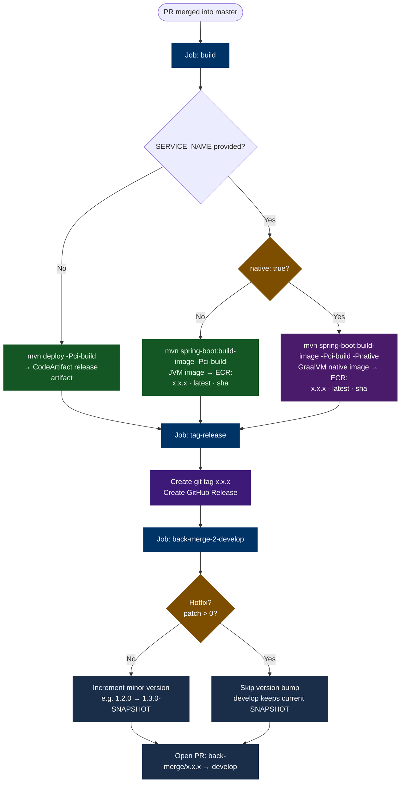

# release.yml

Triggered when a PR is merged into `master`. Publishes the release artifact, creates a git tag and GitHub Release, then opens a back-merge PR into `develop` to keep the two branches in sync.

## What It Does



## Caller Permissions

The job in your project that calls this workflow **must** declare:

```yaml
permissions:
  contents: write
  pull-requests: write
```

GitHub only passes down the permissions the caller explicitly grants to nested reusable workflow jobs. Without this block, the `tag-release` job cannot push a git tag or create a GitHub Release (`contents: write`), and the `back-merge-2-develop` job cannot open the back-merge PR (`pull-requests: write`).

## Inputs

| Input | Required | Default | Description |
|---|---|---|---|
| `AWS_REGION` | Yes | — | AWS region for CodeArtifact and ECR |
| `SERVICE_NAME` | No | `''` | ECR repository name. Omit for library projects. |
| `java-version` | No | `'21'` | Temurin JDK version passed to `actions/setup-java` in both the `build` and `back-merge-2-develop` jobs. |
| `working-directory` | No | `'.'` | Directory containing `pom.xml`. Set to the service subdirectory in a monorepo. Applied to all three jobs: `build`, `tag-release`, and `back-merge-2-develop`. |
| `native` | No | `false` | When `true`, adds `-Pnative` to the build-image command to produce a GraalVM native image. Match this to your `build.yml` setting — the same image type should be used across both SNAPSHOT and release builds. Requires a `native` Maven profile with `native-maven-plugin` in `pom.xml`. |

## Three Jobs

### 1. `build`

Identical to `build.yml` except the image tag for deployables is the **exact project version** (no build number suffix):

| Workflow | Image tag |
|---|---|
| `build.yml` | `x.x.x.<run_number>` |
| `release.yml` | `x.x.x` |

For libraries, runs `mvn deploy -Pci-build` to publish the release JAR to CodeArtifact.

### 2. `tag-release`

Uses a **GitHub App token** (not `GITHUB_TOKEN`) to:

1. Read the project version from `pom.xml`.
2. Create an annotated git tag with that version.
3. Push the tag to the remote.
4. Create a GitHub Release with auto-generated release notes.

:::info Why a GitHub App token?
`GITHUB_TOKEN` cannot trigger further workflow runs — a security restriction GitHub imposes to prevent infinite loops. The version-bump commit and back-merge PR created in the next job need to re-trigger CI on `develop`. A GitHub App token bypasses this restriction. See [GitHub App Setup](../guides/github-app-setup).
:::

### 3. `back-merge-2-develop`

Opens a PR to keep `develop` in sync with `master` after the release. The branch is named `back-merge/<version>`.

The job also handles the **version bump** logic. It reads the patch component of the release version:

| Release version | Patch | Action |
|---|---|---|
| `1.2.0` (normal release) | `0` | Increment minor: `develop` → `1.3.0-SNAPSHOT` |
| `1.2.1` (hotfix) | `> 0` | Skip bump: `develop` keeps its current SNAPSHOT version |

This distinction matters because a hotfix is an emergency patch off `master` — `develop` is already ahead of it and has the correct next version. A normal release, by contrast, has just cut a version that `develop` needs to move past.

The merge uses `git merge -X ours origin/master` — if there are conflicts, `develop`'s files win automatically.

## Monorepo Usage

In a monorepo, pass `working-directory` alongside `paths:` in the trigger to scope the release workflow to a single service. All three jobs (`build`, `tag-release`, `back-merge-2-develop`) run their Maven and git commands from that subdirectory.

```yaml
# .github/workflows/release-my-service.yml
name: "Release My Service"

on:
  pull_request:
    types: [closed]
    branches: [master]
    paths: ['services/my-service/**']   # only trigger for this service

jobs:
  release-workflow:
    uses: awesomaticza/github-workflows/.github/workflows/release.yml@master
    permissions:
      contents: write
      pull-requests: write
    with:
      AWS_REGION: ${{ vars.AWS_REGION }}
      SERVICE_NAME: my-service
      java-version: '25'
      working-directory: services/my-service   # pom.xml lives here
      native: true                             # match your build.yml setting
    secrets:
      AWS_ACCESS_KEY_ID: ${{ secrets.AWS_ACCESS_KEY_ID }}
      AWS_ACCOUNT_ID: ${{ secrets.AWS_ACCOUNT_ID }}
      AWS_SECRET_ACCESS_KEY: ${{ secrets.AWS_SECRET_ACCESS_KEY }}
      CI_APP_ID: ${{ secrets.CI_APP_ID }}
      CI_APP_PRIVATE_KEY: ${{ secrets.CI_APP_PRIVATE_KEY }}
      CODEARTIFACT_DOMAIN: ${{ secrets.CODEARTIFACT_DOMAIN }}
      CODEARTIFACT_RELEASES_REPO: ${{ secrets.CODEARTIFACT_RELEASES_REPO }}
      CODEARTIFACT_SNAPSHOTS_REPO: ${{ secrets.CODEARTIFACT_SNAPSHOTS_REPO }}
```

The `back-merge-2-develop` job reads and bumps `pom.xml` inside `working-directory`, so the version commit and back-merge PR correctly update only the service that was released — other services in the monorepo are untouched.

:::warning Always merge the back-merge PR
The back-merge PR is not optional. If you skip it, `develop` diverges from `master`. For a normal release this means the version bump is lost — the next release will be cut from the wrong version. For a hotfix, the fix itself is lost from the development line and will reappear as a bug in the next release.

**Always merge the back-merge PR before starting any new feature work.**
:::
